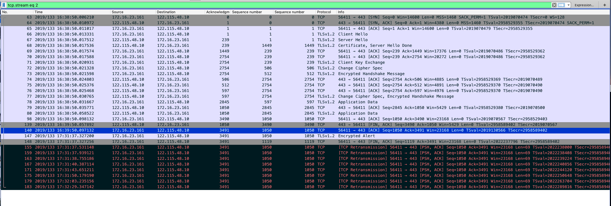
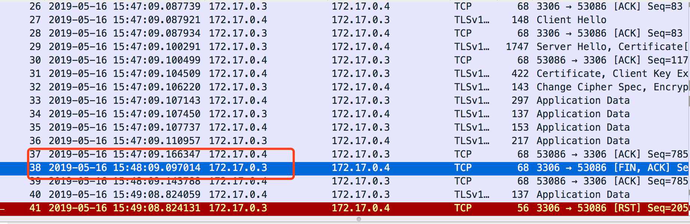

### tcp\_fin\_timeout的作用

又是被大佬鄙视的一天，又学到了一些知识，开心:)。

事情是这样的，大佬下午突然发过来一张抓包截图，考下我能看出什么问题。当时除了心情紧张，只剩下一脸懵逼了。

乍一看截图，TLS协议，心中有数，肯定是后端MySQL使用了SSL加密。随后看到客户端一个小时左右没有发送新数据，Server端发送了`FIN`数据包，断开了连接。这现象应该是 客户端空闲连接触发了MySQL设置的`interactive_timeout`阈值。分析道这里，感觉自己可以做实验模拟下。然后就模拟了下，实验截图如下。

一看截图差不多嘛，然后得意的把自己分析和模拟的结果发给了大佬，并等待大佬的夸奖。

大佬的评价大概意思就是：我目前水平只停留在会抓包的水平，都没分析对。

顿时更加懵逼，赶紧请大佬解释下。

原来，截图中的服务器，并非MySQL，当作MySQL分析就是错的。而且，我并没注意到，大佬发的图中是没有`RST`数据包的。

正常来讲，Server端发送`FIN`，进入`FIN_WAIT_1`，随后收到客户端的`ACK`，状态变成`FIN_WAIT_2`，操作系统默认`tcp_fin_timeout`是60秒，而客户端1个小时没有新消息，肯定`tcp_fin_timeout`已经超时了，这个时候，应该状态到`TIME_WAIT`，随之到`CLOSE`，Server端彻底关闭了连接。1小时后，客户端又发送了消息，Server端应该发现当前连接不存在，发送客户端`RST`数据包。但是抓包看是没有发送`RST`的。

大佬说，Server端使用了`ssl offload`机制，f5的Bug导致的没有`RST`。

总结下来，一共两个问题：

- 客户端关闭太慢
- Server没有发送`RST`
