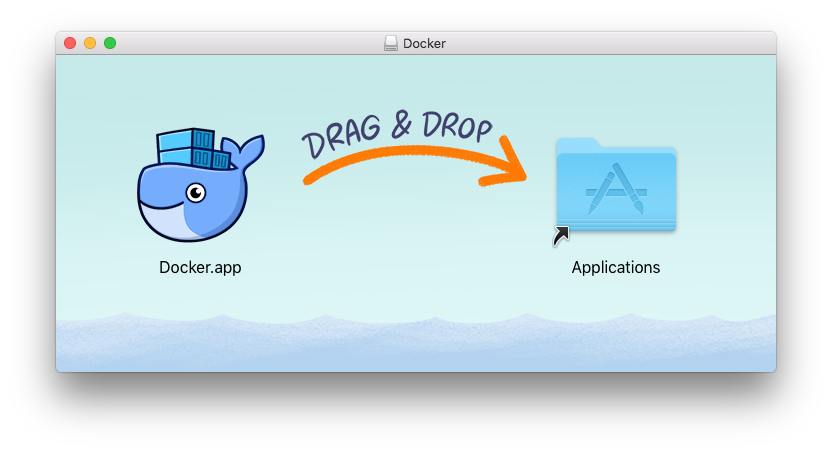
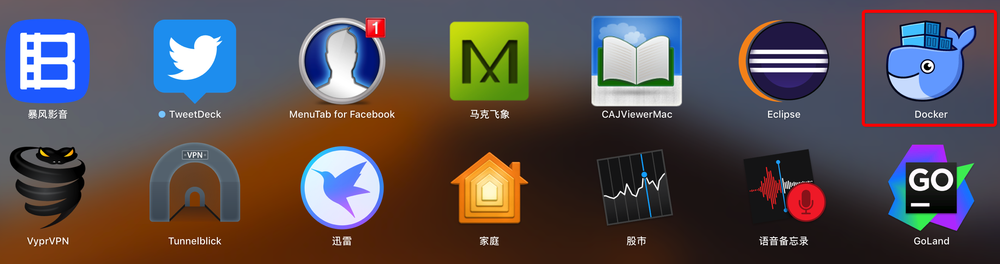

### Docker上搭建Cetus测试环境

#### 1 Docker的安装与运行
下载Docker的安装文件[Docker.dmg](https://docs.docker.com/docker-for-mac/install/)，下载到本地后，双击该文件进行安装。



Docker安装到Mac后，双击该图标，启动Docker。



Docker启动之后，会在Mac的右上角的工具栏中以小图标显示，双击该Docker图标，可以进行登录/查看Docker运行状态/配置等等。


确认Docker正常运行后，Docker环境已经安装完成，可以进行后续操作。


#### 2 Docker常用的命令

下述常见的命令不用刻意记住，后续的例子都会涉及这些例子，通过例子会很清楚各个命令的作用。

```
## 查看Docker版本
docker version

## 显示Docker系统信息
docker info

## 从Docker Hub 中搜索符合条件的镜像
docker search xxx

## 拉取指定镜像
git pull xxx

## 列出所有容器
docker ps -a

## 列出所有运行中的容器
docker ps

## 查看与删除镜像
docker images
docker images -a
docker rmi xxx

## 创建某个容器
docker run -v ~/workstation:/data -it -d --name xxx centos:6.6 /bin/bash

## 启动容器
docker start xxx

## 关闭容器
docker stop xxx

## 进入某个容器
docker exec -it xxx /bin/bash

## 保存容器更改
docker commit [id] xxx
```


#### 3 在docker中搭建MySQL实例

接下来将使用centos6.6的镜像搭建MySQL5.7的一主一从环境，一主多从环境类似可以自行尝试配置。

##### 3.1 拉取centos6.6镜像
```
## 拉取镜像
docker pull centos:6.6

## 查看拉取的镜像
docker images
```

##### 3.2 容器中部署MySQL主库

```
## 创建容器名叫 master，使用的是 centos:6.6的镜像
## 将本地~/workspace盘 挂在到 /data 目录
## 允许做一些调试工作 --privileged
docker run -v ~/workspace:/data --privileged -it -d --name master centos:6.6 /bin/bash

## 查看创建的容器
docker ps -a|grep master

## 启动容器
docker start master

## 进入容器
docker exec -it master /bin/bash

## 安装基本工具
yum install wget vim -y

## 安装MySQL5.7 yum源
wget https://repo.mysql.com/mysql57-community-release-el6.rpm
rpm -ivh mysql57-community-release-el6.rpm

## 查看yum源
yum list|grep -i mysql|grep 5.7

## 安装MySQL server
yum install mysql-community-server.x86_64 -y

## 修改MySQL配置文件
## MySQL默认配置文件在/etc/my.cnf
## 打开配置文件，在[mysqld]下添加以下内容
server-id=1001
log-slave-updates=true
binlog-format=ROW
gtid-mode=on
enforce-gtid-consistency=true

log-bin=binlog

## 启动MySQL
service mysqld start

## 日志中生成初始密码
cat /var/log/mysqld.log
 A temporary password is generated for root@localhost: z4obba/&QGxN
 
## 使用默认密码登录(注意，密码可能有特殊字符，因此尽量不要写在-p后面，回车后再输入密码)
mysql -uroot -hlocalhost -p
 
## 修改原始密码
alter user user() identified by 'Zxcvbnm,lp-1234';

## 授权测试密码
grant all on *.* to 'ght'@'%' identified by 'Zxcvbnm,lp-1234';
```

##### 3.3 容器中部署MySQL从库

部署从库和部署主库步骤类似，唯一不同是，需要配置主从复制。详细步骤如下：

```
## 创建容器名叫 slave，使用的是 centos:6.6的镜像
## 将本地~/workspace盘 挂在到 /data 目录
## 允许做一些调试工作 --privileged
docker run -v ~/workspace:/data --privileged -it -d --name slave centos:6.6 /bin/bash

## 查看创建的容器
docker ps -a|grep slave

## 启动容器
docker start slave

## 进入容器
docker exec -it slave /bin/bash

## 安装基本工具
yum install wget vim -y

## 安装MySQL5.7 yum源
wget https://repo.mysql.com/mysql57-community-release-el6.rpm
rpm -ivh mysql57-community-release-el6.rpm

## 查看yum源
yum list|grep -i mysql|grep 5.7

## 安装MySQL server
yum install mysql-community-server.x86_64 -y

## 修改MySQL配置文件
## MySQL默认配置文件在/etc/my.cnf
## 打开配置文件，在[mysqld]下添加以下内容
server-id=1002
log-slave-updates=true
binlog-format=ROW
gtid-mode=on
enforce-gtid-consistency=true

## 启动MySQL
service mysqld start

## 日志中生成初始密码
cat /var/log/mysqld.log
 A temporary password is generated for root@localhost: z4obba/&QGxN
 
## 使用默认密码登录(注意，密码可能有特殊字符，因此尽量不要写在-p后面，回车后再输入密码)
mysql -uroot -hlocalhost -p
 
## 修改原始密码
alter user user() identified by 'Zxcvbnm,lp-1234';

## 授权测试密码
grant all on *.* to 'ght'@'%' identified by 'Zxcvbnm,lp-1234';

## 配置主从复制
## 在从库上
## 假设主库Ip是172.17.0.2
change master to master_host='172.17.0.2', master_port=3306, master_user='ght', master_password='Zxcvbnm,lp-1234', master_auto_position=1 ;

start slave;

## 查看从库是否同步正常
## Slave_IO_Running: Yes Slave_SQL_Running: Yes 则正常
show slave status\G

```

#### 4 在docker中搭建Cetus实例

和搭建MySQL流程类似，以搭建读写分离版本Cetus为例，具体步骤如下：

```
## 创建容器名叫 cetus1，使用的是 centos:6.6的镜像
## 将本地~/workspace盘 挂在到 /data 目录
## 允许做一些调试工作 --privileged
docker run -v ~/workspace:/data --privileged -it -d --name cetus1 centos:6.6 /bin/bash

## 查看创建的容器
docker ps -a|grep cetus1

## 启动容器
docker start cetus1

## 进入容器
docker exec -it cetus1 /bin/bash

## 安装基本工具
yum install wget vim git -y

## 安装MySQL5.7 yum源
wget https://repo.mysql.com/mysql57-community-release-el6.rpm
rpm -ivh mysql57-community-release-el6.rpm

## 退出容器
exit

## clone Cetus源码
## 由于Mac的~/workspace 目录映射成了docker的/data目录，因此，我们在Mac上，将Cetus源码clone到～/workspace目录下
git clone https://github.com/cetus-tools/cetus.git my_cetus

## 进入容器
docker exec -it cetus1 /bin/bash

## 安装必要的库
yum install cmake gcc glib2-devel zlib-devel flex mysql-devel gperftools-libs -y

## 编译Cetus
cd /data/my_cetus
mkdir bld
cd bld
cmake ../ -DCMAKE_BUILD_TYPE=Debug -DCMAKE_INSTALL_PREFIX=/home/gaohaitao/cetus_install -DSIMPLE_PARSER=ON
make install

## 配置Cetus
## cd到安装目录
cd /home/gaohaitao/cetus_install/

## 配置用户
cp conf/users.json.example  conf/users.json

{
        "users":        [{
                        "user": "ght",
                        "client_pwd":   "Zxcvbnm,lp-1234",
                        "server_pwd":   "Zxcvbnm,lp-1234"
                }
}

## 配置配置文件
cp conf/proxy.conf.example  conf/proxy.conf
chmod 660 conf/proxy.conf

proxy-address=0.0.0.0:6001
admin-address=0.0.0.0:7001
proxy-backend-addresses=172.17.0.2:3306
proxy-read-only-backend-addresses=172.17.0.4
default-db=test
default-username=ght
log-file=/cetus.log
log-level=message
check-slave-delay=false

## 安装MySQL客户端
yum install mysql-community-client.x86_64 -y

## 使用MySQL客户端登录管理端口验证
mysql -uadmin -padmin -h127.0.0.1 -P7001
```
